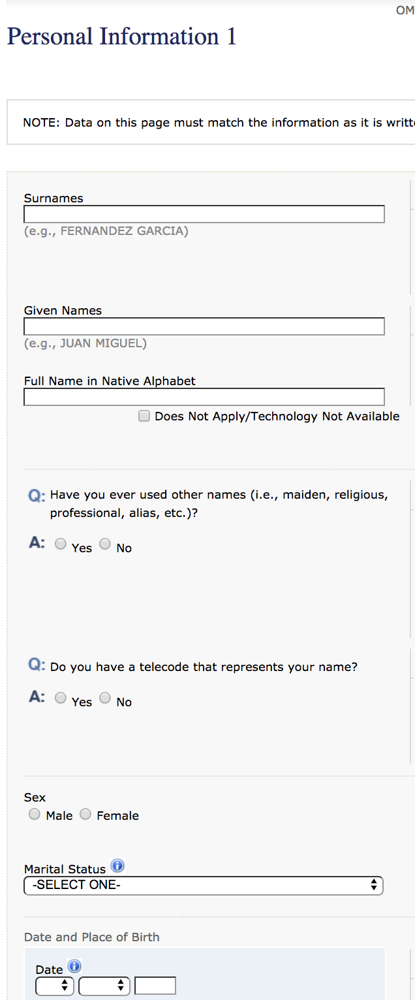

# Mate Academy Frontend practice with html forms

## The task:
Create HTML page with form which send form data to `https://mate-academy-form-lesson.herokuapp.com/create-application`.
The form should be similar to DS-160 US visa form - https://ceac.state.gov/GenNIV/

Screenshot of this form:

The basic implementation of this form you can find [here](https://mate-academy-form-lesson.herokuapp.com)

## Requirements:

Form should have different inputs with such types:
  - text
  - number
  - email
  - checkbox
  - radio
  - password
  - range
  - time
  - color
  - date

Also form should has textarea ans select elements.
  
Every field should has label which focus the input by click.
  
Every field should has at least one validation - required, min, max, minlength, maxlength, etc
At least one field should have default value.
At least one field should have placeholder value.
At least one field should has disabled autocomplete.

## How this app is working

Simple request/response nodejs app with Pug and Express. The app hosted in [heroku](https://mate-academy-form-lesson.herokuapp.com)
